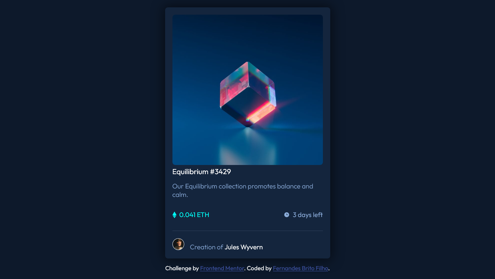
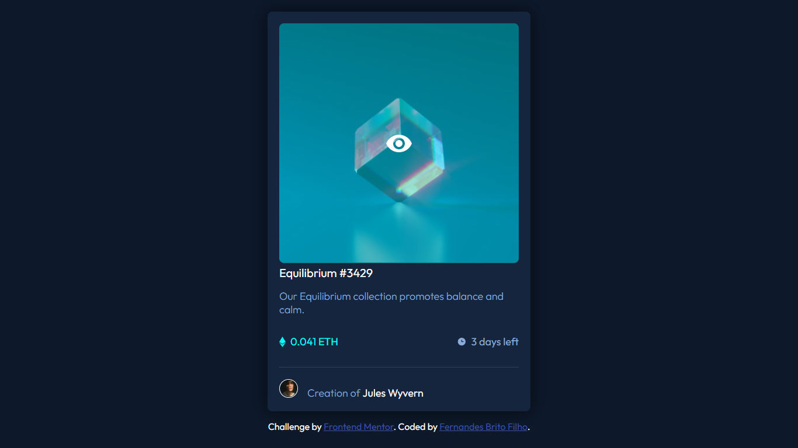

# Frontend Mentor - NFT preview card component solution

Essa é a solução do desafio [NFT preview card component challenge on Frontend Mentor](https://www.frontendmentor.io/challenges/nft-preview-card-component-SbdUL_w0U). Os desafios Frontend Mentor ajudam a melhor e aplicar suas habildades em Front-End em práticas realistas.

# Frontend Mentor - NFT preview card component

## Table of contents

- [Visão Geral](#overview)
  - [O desafio](#the-challenge)
  - [Capturas de tela](#screenshot)
  - [Links](#links)
- [Meu processo](#my-process)
  - [Feito com](#built-with)
  - [O que eu aprendi](#what-i-learned)
  - [Desenvolvimento contínuo](#continued-development)
  - [Recursos úteis](#useful-resources)
- [Autor](#author)

## Overview

  Esse foi um primeiro desafio bastante didático e divertido, no qual eu precisaria de certos conhecimentos básicos para conseguir recriar o desafio da maneira mais fiel possível usando o conhecimento que já adquiri durante minha jornada de aprendizado

### The challenge

  Os usuários devem ser capazes de:

  - Visualizar todos os componentes em determinado tamanho de tela
  - Ver os diferentes estados de elementos interativos

### Screenshot

### Links

- Link da solução: [EM BREVE]
- Site da solução ao vivo: [EM BREVE]

## My process

  Eu inicialmente comecei importando todos os elementos e estudando uma solução para organizar, utilizei meus conhecimentos de manipulação de divs e componentes para fazer isso, optei por usar ~article~ na organização pois é uma maneira mais simples de manejar o conteúdo (na minha opinião), tive certas dificuldades em relação a usar px como medida, e optei por utilizar rems em determinados locais, quando ficava estagnado em determinado local eu consultava na internet possíveis maneiras de realizar
  como um bom brasileiro, utilizei algumas "gambiarras" para conseguir ficar cada vez mais próximo do fiel
  tive certas dificuldades também em relação a hierarquia dos componentes, mas no geral eu me sinto bastante satisfeito em ter conseguido chegar próximo do resultado ideal.

### Built with

- Semantic HTML5 markup
- CSS custom properties
- Mobile-first workflow

### What I learned

  Aprendi a manejar melhor os componentes e aprimorei minhas habilidades de CSS, também aprendi a usar bastante a mente em processos criativos

### Continued development

  Pretendo continuar estudando front-end e irei realizar outros desafios para que possa me aperfeiçoar bastante, também pretendo estudar JavaScript para conseguir desenvolver sites cada vez mais complexos que possam atender necessidades reais das pessoas

### Useful resources

- [w3schools](https://www.w3schools.com/) - A W3 me ajudou bastante a conseguir relembrar alguns conceitos de html e css, bastante útil para praticamente tudo que eu precisei saber
- [Youtube](https://www.youtube.com/) - Rico em diversos conteúdos em explicações excelentes, não vou destacar algum canal em específico pois vai de preferência para cada um.

## Author

- LinkedIn - [Fernandes Brito Filho](https://www.linkedin.com/in/Fernandes619/)
- Frontend Mentor - [@Fernandesffb](https://www.frontendmentor.io/profile/Fernandesffb)
- Website - [EM BREVE]
